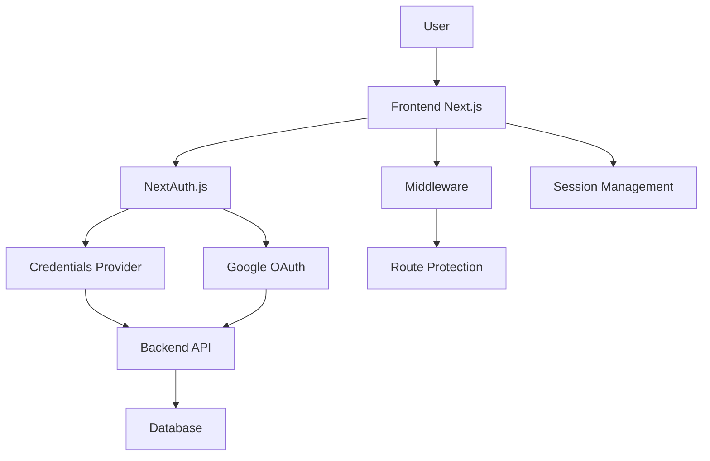

# FDAware Authentication System Documentation

## Table of Contents
1. [Overview](#overview)
2. [Architecture](#architecture)
3. [Authentication Methods](#authentication-methods)
4. [Frontend Implementation](#frontend-implementation)
5. [Backend Integration](#backend-integration)
6. [Session Management](#session-management)
7. [Route Protection](#route-protection)
8. [Onboarding Flow](#onboarding-flow)
9. [Environment Configuration](#environment-configuration)
10. [API Endpoints](#api-endpoints)
11. [Error Handling](#error-handling)
12. [Security Considerations](#security-considerations)
13. [Troubleshooting](#troubleshooting)
14. [Development Setup](#development-setup)

## Overview

FDAware uses NextAuth.js v4 with a hybrid authentication system supporting both traditional email/password authentication and Google OAuth. The system integrates with a custom backend API for user management and implements a comprehensive onboarding flow.

### Key Features
- **Dual Authentication**: Email/password + Google OAuth
- **JWT-based Sessions**: Secure token-based authentication
- **Onboarding Flow**: Mandatory user setup process
- **Route Protection**: Middleware-based access control
- **Backend Integration**: Custom API for user management
- **Profile Management**: User profile and image handling

## Architecture



### Components
- **Frontend**: Next.js 15 with TypeScript
- **Authentication**: NextAuth.js v4
- **Backend**: Custom Node.js API (localhost:10000)
- **Database**: Backend-managed user storage
- **Session**: JWT tokens with NextAuth session management

## Authentication Methods

### 1. Email/Password Authentication

**Flow:**
1. User enters email/password on sign-in page
2. Frontend calls `authService.login()`
3. NextAuth credentials provider calls backend `/api/auth/login`
4. Backend validates credentials and returns JWT token
5. NextAuth creates session with backend token

**Implementation:**
```typescript
// Frontend sign-in
const result = await signIn("credentials", {
  redirect: false,
  email,
  password,
})
```

**Backend Endpoint:**
```
POST /api/auth/login
Body: { email: string, password: string }
Response: { token: string, user: UserObject, onboardingComplete: boolean }
```


## Frontend Implementation

### NextAuth Configuration

**File:** `app/api/auth/[...nextauth]/route.ts`

```typescript
export const authOptions: NextAuthOptions = {
  providers: [
    GoogleProvider({
      clientId: process.env.GOOGLE_CLIENT_ID!,
      clientSecret: process.env.GOOGLE_CLIENT_SECRET!,
    }),
    CredentialsProvider({
      name: "Credentials",
      credentials: {
        email: { label: "Email", type: "email" },
        password: { label: "Password", type: "password" },
      },
      async authorize(credentials) {
        // Backend authentication call
        const res = await fetch("http://localhost:10000/api/auth/login", {
          method: "POST",
          headers: { "Content-Type": "application/json" },
          body: JSON.stringify({
            email: credentials?.email,
            password: credentials?.password,
          }),
        })
        const user = await res.json()
        if (res.ok && user) {
          return { ...user, token: user.token }
        }
        return null
      },
    }),
  ],
  session: { strategy: "jwt" },
  callbacks: {
    // JWT and session callbacks for token management
    // Redirect callback for post-authentication routing
  },
}
```

### Authentication Service

**File:** `lib/services/authService.ts`

```typescript
export const authService = {
  login: async (email: string, password: string) => {
    const res = await axiosInstance.post(API_ENDPOINTS.login, { email, password })
    return res.data
  },
  signup: async (formData: FormData) => {
    const res = await axiosInstance.post(API_ENDPOINTS.signup, formData, {
      headers: { "Content-Type": "multipart/form-data" },
    })
    return res.data
  },
  onboarding: async (data: any, token?: string) => {
    const res = await axiosInstance.post(API_ENDPOINTS.onboarding, data, {
      headers: token ? { Authorization: `Bearer ${token}` } : {},
    })
    return res.data
  },
  // ... other methods
}
```

### Type Definitions

**File:** `types/next-auth.d.ts`

```typescript
declare module "next-auth" {
  interface Session {
    backendToken?: string
    onboardingComplete?: boolean
    user: {
      id: string
      name?: string | null
      email?: string | null
      image?: string | null
      profileImage?: string | null
    }
  }
}

declare module "next-auth/jwt" {
  interface JWT {
    backendToken?: string
    onboardingComplete?: boolean
    profileImage?: string | null
  }
}
```

## Backend Integration

### Required Backend Endpoints

#### 1. Login Endpoint
```
POST /api/auth/login
Content-Type: application/json

Request Body:
{
  "email": "user@example.com",
  "password": "userpassword"
}

Response:
{
  "token": "jwt_token_here",
  "user": {
    "id": "user_id",
    "email": "user@example.com",
    "name": "User Name",
    "profileImage": "image_url",
    "onboardingComplete": false
  }
}
```


#### 3. Signup Endpoint
```
POST /api/auth/signup
Content-Type: multipart/form-data

Request Body (FormData):
- firstName: string
- lastName: string
- email: string
- company: string
- password: string
- profileImage: File (optional)

Response:
{
  "message": "User created successfully",
  "user": {
    "id": "user_id",
    "email": "user@example.com",
    "onboardingComplete": false
  }
}
```

#### 4. Onboarding Endpoint
```
POST /api/users/onboarding
Authorization: Bearer <jwt_token>
Content-Type: application/json

Request Body:
{
  "companyType": "FOOD_MANUFACTURER",
  "teamSize": "TWO_TO_FIVE",
  "labelsPerMonth": "SIX_TO_TWENTY",
  "goals": ["REDUCE_COSTS", "SPEED_LAUNCH"],
  "complianceProcess": "IN_HOUSE_TEAM"
}

Response:
{
  "message": "Onboarding completed",
  "onboardingComplete": true
}
```

### Database Schema Requirements

```sql
-- Users table
CREATE TABLE users (
  id VARCHAR(255) PRIMARY KEY,
  email VARCHAR(255) UNIQUE NOT NULL,
  password VARCHAR(255), -- NULL for OAuth users
  name VARCHAR(255),
  profile_image_url TEXT,
  onboarding_complete BOOLEAN DEFAULT FALSE,
  created_at TIMESTAMP DEFAULT CURRENT_TIMESTAMP,
  updated_at TIMESTAMP DEFAULT CURRENT_TIMESTAMP ON UPDATE CURRENT_TIMESTAMP
);
```

## Session Management

### JWT Callbacks

**JWT Callback** (`app/api/auth/[...nextauth]/route.ts`):
```typescript
async jwt({ token, user, account }) {
  // Handle credentials login
  if (user && (user as any).token) {
    token.backendToken = (user as any).token
  }
  
  return token
}
```

**Session Callback**:
```typescript
async session({ session, token }) {
  // Make backend token and onboardingComplete available in session
  if (token && (token as any).backendToken) {
    (session as any).backendToken = (token as any).backendToken
  }
  if (typeof (token as any).onboardingComplete !== 'undefined') {
    (session as any).onboardingComplete = (token as any).onboardingComplete;
  }
  if (session.user && (token as any).profileImage) {
    (session.user as any).profileImage = (token as any).profileImage;
  }
  return session
}
```

### Session Usage in Components

```typescript
import { useSession } from "next-auth/react"

function MyComponent() {
  const { data: session, status } = useSession()
  
  if (status === "loading") return <p>Loading...</p>
  if (status === "unauthenticated") return <p>Access Denied</p>
  
  // Access session data
  const backendToken = (session as any).backendToken
  const onboardingComplete = (session as any).onboardingComplete
  const profileImage = (session.user as any).profileImage
  
  return <div>Welcome {session.user?.name}</div>
}
```

## Route Protection

### Middleware Implementation

**File:** `middleware.ts`

```typescript
import { NextResponse } from 'next/server'
import type { NextRequest } from 'next/server'
import { getToken } from 'next-auth/jwt'

// Routes that require authentication
const protectedRoutes = ['/dashboard', '/onboarding']
// Routes that should NOT be accessed when authenticated
const publicOnlyRoutes = ['/auth/signin', '/auth/signup']

export async function middleware(request: NextRequest) {
  const { pathname } = request.nextUrl

  // Check if route is protected
  if (protectedRoutes.some((route) => pathname.startsWith(route))) {
    const token = await getToken({ req: request, secret: process.env.NEXTAUTH_SECRET })
    if (!token) {
      // Not authenticated, redirect to home
      const url = request.nextUrl.clone()
      url.pathname = '/'
      return NextResponse.redirect(url)
    }
    // Check onboarding status
    if (typeof token.onboardingComplete !== 'undefined' && 
        token.onboardingComplete === false && 
        pathname !== '/onboarding') {
      const url = request.nextUrl.clone()
      url.pathname = '/onboarding'
      return NextResponse.redirect(url)
    }
  }

  // Check if route should not be accessed when authenticated
  if (publicOnlyRoutes.some((route) => pathname.startsWith(route))) {
    const token = await getToken({ req: request, secret: process.env.NEXTAUTH_SECRET })
    if (token) {
      // Authenticated, redirect to dashboard
      const url = request.nextUrl.clone()
      url.pathname = '/dashboard'
      return NextResponse.redirect(url)
    }
  }

  return NextResponse.next()
}

export const config = {
  matcher: [
    '/dashboard/:path*',
    '/onboarding/:path*',
    '/onboarding',
    '/auth/signin',
    '/auth/signup',
  ],
}
```

### Route Categories

1. **Public Routes**: Accessible without authentication
   - `/` (home page)
   - `/about`, `/contact`, `/pricing`
   - `/terms-of-service`, `/privacy-policy`

2. **Protected Routes**: Require authentication
   - `/dashboard/*` - Main application
   - `/onboarding` - User setup process

3. **Auth-Only Routes**: Only accessible when NOT authenticated
   - `/auth/signin` - Sign in page
   - `/auth/signup` - Sign up page

## Onboarding Flow

### Flow Overview

1. **New User Signs Up/In** → `onboardingComplete: false`
2. **Middleware Redirects** → `/onboarding`
3. **User Completes Onboarding** → Backend updates `onboardingComplete: true`
4. **Session Refresh** → User can access `/dashboard`

### Onboarding Implementation

**File:** `components/onboarding/onboarding-flow.tsx`

```typescript
const handleNext = async () => {
  if (currentStep < totalSteps) {
    setCurrentStep(currentStep + 1)
  } else {
    // Complete onboarding
    const payload = {
      companyType: formData.companyType,
      teamSize: formData.teamSize,
      labelsPerMonth: formData.labelsPerMonth,
      goals: formData.goals,
      complianceProcess: formData.complianceProcess,
    }
    
    const token = session && (session as any).backendToken
    await authService.onboarding(payload, token)
    
    // Create workspace
    const workspaceRes = await workspaceService.createWorkspace(
      formData.workspaceName, 
      token
    )
    
    // Force page refresh to get updated session
    window.location.href = "/dashboard"
  }
}
```

### Onboarding Steps

1. **Company Information**
   - Workspace name
   - Company type (Food Manufacturer, Supplement, etc.)

2. **Team & Volume**
   - Team size
   - Labels per month

3. **Goals & Process**
   - Primary goals
   - Current compliance process

4. **Completion**
   - Summary and next steps

## Environment Configuration

### Required Environment Variables

**File:** `.env.local`

```env

# NextAuth
NEXTAUTH_URL=http://localhost:3000
NEXTAUTH_SECRET=your_nextauth_secret_here

# Backend API
NEXT_PUBLIC_API_URL=http://localhost:10000/api

# Cloudinary (for profile images)
NEXT_PUBLIC_CLOUDINARY_CLOUD_NAME=your_cloud_name
NEXT_PUBLIC_CLOUDINARY_UPLOAD_PRESET=your_upload_preset
```


## API Endpoints

### Frontend API Configuration

**File:** `lib/api.ts`

```typescript
export const API_BASE_URL = "http://localhost:10000/api";

export const API_ENDPOINTS = {
  login: "/auth/login",
  signup: "/auth/signup",

  onboarding: "/users/onboarding",
  changePassword: "/users/me/change-password",
  forgotPassword: "/auth/forgot-password",
  resetPassword: "/auth/reset-password",
  getProfile: "/users/me",
  updateProfile: "/users/me",
};
```

### Backend API Requirements

| Endpoint | Method | Auth Required | Description |
|----------|--------|---------------|-------------|
| `/api/auth/login` | POST | No | Email/password authentication |
| `/api/auth/signup` | POST | No | User registration |

| `/api/users/onboarding` | POST | Yes | Complete user onboarding |
| `/api/users/me` | GET | Yes | Get user profile |
| `/api/users/me` | PUT | Yes | Update user profile |
| `/api/users/me/change-password` | POST | Yes | Change password |
| `/api/auth/forgot-password` | POST | No | Request password reset |
| `/api/auth/reset-password` | POST | No | Reset password with token |

## Error Handling

### Authentication Errors

```typescript
// Sign-in error handling
try {
  const result = await signIn("credentials", {
    redirect: false,
    email,
    password,
  })
  if (result?.error) {
    setError("Invalid email or password.")
    toast({ 
      title: "Sign in failed", 
      description: "Invalid email or password." 
    })
  }
} catch (err: any) {
  setError("Sign in failed. Please try again.")
  toast({ 
    title: "Sign in failed", 
    description: err?.response?.data?.message || "Please try again." 
  })
}
```

### Common Error Scenarios

1. **Invalid Credentials**: 401 Unauthorized
2. **User Not Found**: 404 Not Found
3. **Email Already Exists**: 409 Conflict
4. **Invalid Token**: 401 Unauthorized
5. **Onboarding Required**: Middleware redirect

### Error Response Format

```typescript
// Backend error response
{
  "error": "Error message",
  "message": "Detailed error description",
  "statusCode": 400
}
```

## Security Considerations

### JWT Token Security

1. **Token Storage**: JWT tokens stored in HTTP-only cookies by NextAuth
2. **Token Expiration**: 7-day expiration (configurable)
3. **Token Refresh**: Automatic refresh on session access
4. **Backend Validation**: All API calls validate JWT tokens

### Password Security

1. **Hashing**: Backend should hash passwords with bcrypt
2. **Validation**: Strong password requirements
3. **Reset Flow**: Secure password reset with time-limited tokens


### API Security

1. **HTTPS**: All production API calls over HTTPS
2. **CORS**: Proper CORS configuration
3. **Rate Limiting**: Implement rate limiting on auth endpoints
4. **Input Validation**: Validate all input data

## Troubleshooting

### Common Issues


#### 2. Too Many Redirects on Onboarding
**Error**: Infinite redirect loop on `/onboarding`

**Solution**:
- Check middleware logic for onboarding redirect
- Ensure `onboardingComplete` is properly set
- Verify backend returns correct onboarding status

#### 3. Session Not Updating After Onboarding
**Error**: User stuck on onboarding page after completion

**Solution**:
- Use `window.location.href = "/dashboard"` for hard refresh
- Ensure backend updates `onboardingComplete: true`
- Check JWT token contains updated status

#### 4. Backend Token Not Available
**Error**: `backendToken` is undefined in session

**Solution**:
- Verify backend returns token in response
- Check JWT callback properly stores token
- Ensure session callback exposes token

### Debug Mode

Enable NextAuth debug mode:

```env
NEXTAUTH_DEBUG=true
```

### Session Debugging

```typescript
// Debug session data
const { data: session } = useSession()
console.log("Session:", session)
console.log("Backend Token:", (session as any).backendToken)
console.log("Onboarding Complete:", (session as any).onboardingComplete)
```

## Development Setup

### Prerequisites

1. **Node.js**: v18 or higher
2. **npm/yarn**: Package manager
3. **Backend API**: Running on localhost:10000

### Installation Steps

1. **Install Dependencies**:
   ```bash
   npm install next-auth axios
   ```

2. **Environment Setup**:
   ```bash
   cp .env.example .env.local
   # Edit .env.local with your values
   ```

3. **Google OAuth Setup**:
   - Create Google Cloud project
   - Enable Google+ API
   - Create OAuth 2.0 credentials
   - Add redirect URIs

4. **Backend Setup**:
   - Ensure backend API is running
   - Verify all required endpoints exist
   - Test authentication endpoints

### Testing Authentication

1. **Test Email/Password**:
   - Create test user via signup
   - Test login with credentials
   - Verify session creation

2. **Test Google OAuth**:
   - Click "Continue with Google"
   - Complete OAuth flow
   - Verify user creation in backend

3. **Test Onboarding**:
   - Sign up new user
   - Complete onboarding flow
   - Verify dashboard access

### Production Deployment

1. **Environment Variables**:
   - Set production Google OAuth credentials
   - Update `NEXTAUTH_URL` to production domain
   - Set secure `NEXTAUTH_SECRET`

2. **Google OAuth**:
   - Add production redirect URIs
   - Update authorized origins
   - Verify OAuth consent screen

3. **Backend**:
   - Deploy backend API
   - Update API URLs in frontend
   - Configure HTTPS

4. **Security**:
   - Enable HTTPS
   - Set secure cookies
   - Implement rate limiting

---

## Support

For additional support or questions about the authentication system:

1. Check the troubleshooting section above
2. Review NextAuth.js documentation
3. Verify backend API endpoints
4. Check browser console for errors
5. Enable debug mode for detailed logging

**Last Updated**: December 2024
**Version**: 1.0.0
